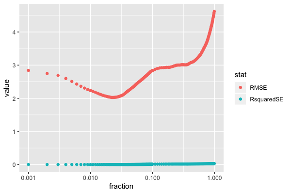
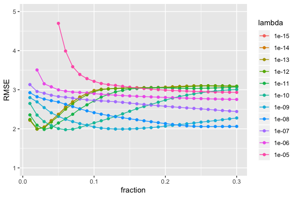

# Chapter 6

# 6.1 

Trying to fit a bunch of models and seeing which one to fit. First thing to do is look at the data;
this has a lot of multicollinearity. Check out this correlation plot: 

Fitting some models and naively choosing the parameter that makes the lowest RMSE gives the following.

Linear regression: 

PLS: 

Ridge: 

Lasso: 

Elastic net: 

Some patterns emerge: Linear regression seems to overfit very easily given
how noisy the fits are. Adding bias markedly reduces variance. Ridge penalties seem to help out a lot. 

Summary of performance is: 

|model |stat |    value| ncomp|   key| fraction| loglambda|
|:-----|:----|--------:|-----:|-----:|--------:|---------:|
|lm    |RMSE | 3.803016|    NA|    NA|       NA|        NA|
|pls   |RMSE | 2.105607|    13|    NA|       NA|        NA|
|ridge |RMSE | 2.142189|    NA| 4e-05|       NA|        NA|
|lasso |RMSE | 2.909513|    NA| 1e-03|       NA|        NA|
|enet  |RMSE | 2.091352|    NA|    NA|     0.16|        -8|

which would indicate choosing elastic net, although pls and ridge also defensible. linear regression performs pooryl, lasso is OK but outclassed by other models. 

### caret approach

We can use caret package to do this better. The caret estimate of RMSE for linear regression is 4.42. 

k-fold cross validated outputs for other models follow: 

PLS: 

Lasso: 

Ridge: 

Elastic net: 

Applying the models to the held out validation set gives the following estimates of performance: 

|id    |     RMSE|  Rsquared|      MAE|
|:-----|--------:|---------:|--------:|
|enet  | 2.457840| 0.9641659| 1.638748|
|lasso | 2.423299| 0.9651549| 1.631413|
|lm    | 3.803016| 0.9209281| 2.561548|
|pls   | 2.959833| 0.9487768| 1.827181|
|ridge | 2.403127| 0.9657451| 1.649992|

From the above looks like ridge regression gives the best performance although could go with elastic net or lasso. 
PLS and LM have slightly too poor performance at high realisations.

 

Linear regression gives huge parameter estimates: 

Lasso: 

Ridge:  

So to keep the parameter estimates reasonable I'd go with lasso here as it has many coeffs set to zero improving robustness. 

# 6.2 

Training some models and applying them to the test data gives the following:

None of them look especially wonderful. Log space is a bit better:

We can compare statistics too: 

|model |     RMSE|  Rsquared|       MAE|what     |
|:-----|--------:|---------:|---------:|:--------|
|Ridge | 13.99264| 0.3818977| 10.082951|Training |
|Ridge | 10.31435| 0.5975644|  8.380650|Testing  |
|PLS   | 12.35496| 0.4290915|  9.361115|Training |
|PLS   | 10.48525| 0.5684578|  8.535680|Testing  |
|lasso | 11.22388| 0.5188240|  8.147752|Training |
|lasso | 11.84277| 0.4249398|  9.186689|Testing  |
|ENet  | 11.10847| 0.5182363|  8.111790|Training |
|ENet  | 11.45635| 0.4670192|  8.684858|Testing  |

I couldn't recommend any of these, however the ridge model seems least worst;

# 6.3 

OK this is interesting. Fitted an elastic net to the data after pre processing it (centred, scaled, box cox to remvoe skew, imputed using median, removed near zero vars, removed highly correlated vars). 
Plot of tuning parameter selection: 

and of the coefficients:

Comparing AvE on the training set gives:

and on the hold out set gives:

Quality of fit on hold out is 

|    RMSE|  Rsquared|       MAE|
|-------:|---------:|---------:|
| 1.15099| 0.7594387| 0.9162539|

Looking at the top 6 predictors we get 

|name                   |      value|
|:----------------------|----------:|
|ManufacturingProcess32 |  0.5253259|
|ManufacturingProcess09 |  0.4928388|
|ManufacturingProcess36 | -0.2942246|
|ManufacturingProcess06 |  0.1348662|
|ManufacturingProcess13 | -0.1319899|
|ManufacturingProcess11 |  0.0945762|

on the transformed scale (due to pre processing, predictors are on the same scale so simple magnitude comparison is OK). 

So I would recommend more or less of the industrial processes above. 
