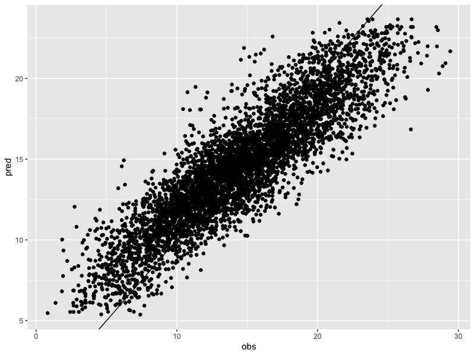

# Chapter 7

# Question 7.1

This is about Support Vector Machines - which are an interesting non linear method which is sensitive to "support vectors" (i.e., "observations") that are close to trend. Data points "close" (within epsilon) of the prediction get no weight in the penalty function which has delta = 1 outwith [-epsilon,epsilon]. The sum of penalties is multiplied by the overall cost (another parameter C), and finally the sum of squared coefficients is added.

So SVMs will prefer models that are close to the prediction and have small parameters, with the relative balance controlled by C. 

The form of parameters is set using a kernel. Linear models have the kernel based on the dot product (e.g., linear regression is basically estimating a vector of coefficients beta such that beta inner producted with predictors x gives you the estimate y). In this instance we look at the radial basis function which is exp(sigma ||x-u||^2); x is a record from the training set and u is the observation to predict. 

We make some fake data based on a noisy sin(x) curve:

Look at how the parameters interplay. Epsilon first:

then cost

and then finally sigma in the kernel

# Question 7.2 

So we have some fake data and we want to fit some models to it and have a look. Fine. Train models on some data and test them on some other data. 

## k nearest neighbours

Doesn't look too great. Look at all that bias. Could be fitting to noise, so (looking ahead and discovering via MARS that only the first five predictors matter) we try fitting to a truncated dataset.

Much better. So KNN needs you to trim uninformative predictors. 

## MARS

Looks good and reasonably tight too. Get interesting curve shapes for informative predictors:

and flat for uninformative ones: 

useful for trimming predictors to improve KNN!

## SVM

The machines look good too:

## Neural Network

Not great, not terrible. Needed a very long computation too.... 

## Summary

|      MAE|     RMSE|  Rsquared|what    |
|--------:|--------:|---------:|:-------|
| 2.586877| 3.214339| 0.6575355|knn     |
| 1.874548| 2.370481| 0.7946572|knn_sub |
| 1.710491| 2.206143| 0.8012192|avNNet  |
| 1.646055| 2.116799| 0.8221731|SVM     |
| 1.413212| 1.798394| 0.8708211|MARS    |

Table says use MARS. Note how KNN got much better when removing uninformative predictors, to the point where it became competitive with SVM and averaged neural networks. 

# 7.3 

Usual routine. Cut data 70/30 training/testing, fit models, apply to testing and see if any good. Also try PCAing data first. Get the following outcomes 

PCA is a red herring here. I am astonished at how good neural networks are here - I imagine they are homing in on the absorption lines associated with fats. Similarly with MARS (not surprising, to the extent that MARS is a restricted neural network). KNN bad. SVM OK ish I suppose but would want better.
