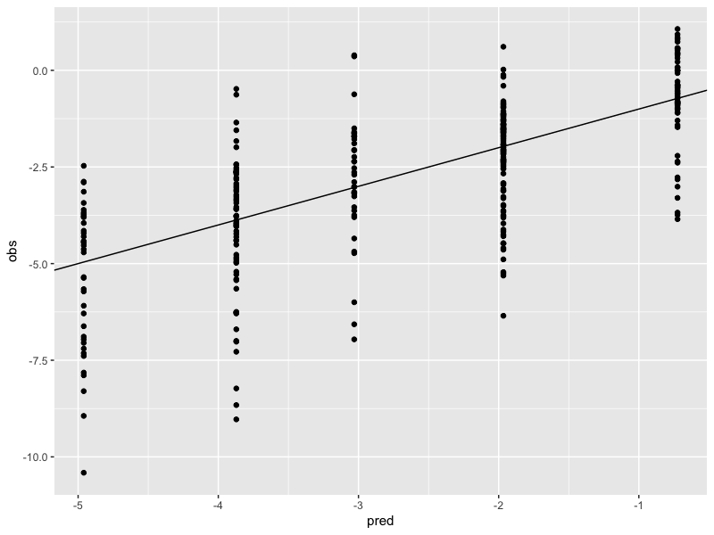
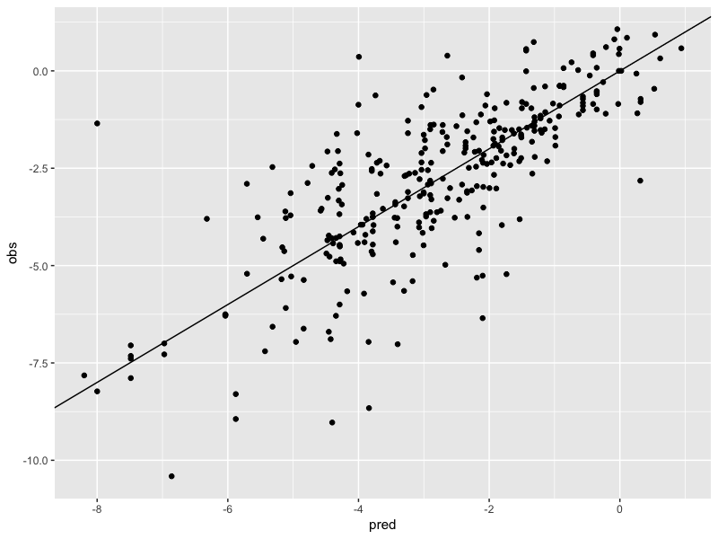
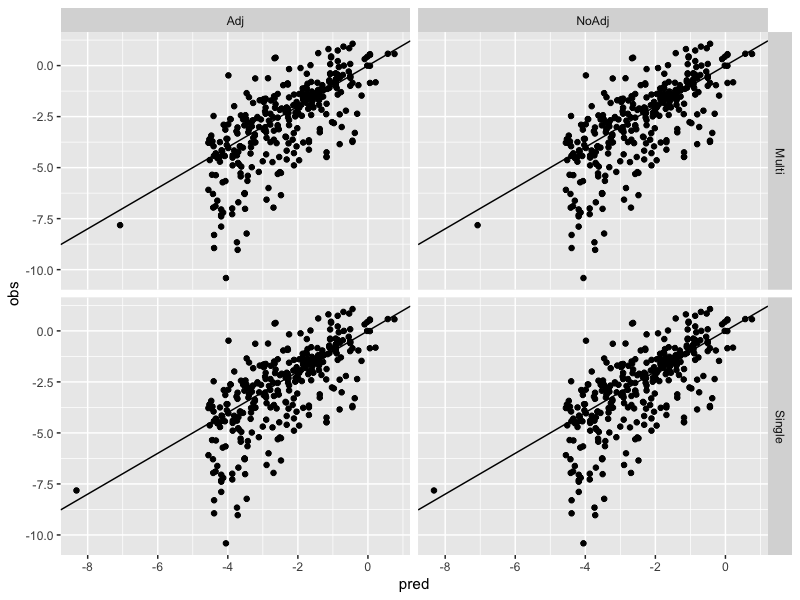

# Chapter 8

## Exercise 8.1

This is about "how do trees behave with highly correlated variables?". We make some data and append two variables V11 and V12 which are highly correlated with V1. What happens?

### Random Forest

The "classical" (LOL) random forest does not discriminate between highly correlated variables and will just tune to them. Observe the following table of importances:

| name|        RF1|        RF2|        RF3|
|----:|----------:|----------:|----------:|
|    1| 38.2980905| 25.3050653| 23.5116617|
|    2| 45.9626079| 46.3552313| 51.0739914|
|    3| 20.9510882| 20.3262398| 20.4956983|
|    4| 64.9328575| 62.2423649| 69.2436558|
|    5| 35.3525887| 33.4885611| 34.2530988|
|    6| -0.4077024|  1.0587831|  0.1084733|
|    7|  0.0439088| -2.1184294| -1.5465883|
|    8| -1.1901692|  0.1714658| -1.3968294|
|    9| -1.1700609| -0.7868506|  1.3159691|
|   10|  0.6545081|  1.8827809| -0.4012091|
|   11|         NA| 24.4319410| 22.7713121|
|   12|         NA|         NA| 16.2404411|

### Conditional Forest

Behaves similarly:

| name|        CF1|        CF2|        CF3|
|----:|----------:|----------:|----------:|
|    1|  5.2559622|  3.2253964|  2.6402796|
|    2|  7.5126777|  7.4961418|  7.2320811|
|    3|  0.4000218|  0.3625080|  0.4653093|
|    4| 14.9375677| 14.5529648| 13.8557695|
|    5|  5.3512755|  5.1799021|  5.1733067|
|    6| -0.0140445| -0.0367219| -0.0710350|
|    7| -0.0662273| -0.0740363| -0.0361514|
|    8| -0.0834524| -0.0624882| -0.0533505|
|    9|  0.0111483| -0.0115248|  0.0096565|
|   10|  0.0019807| -0.0226159|  0.0082810|
|   11|         NA|  2.8685853|  2.1515514|
|   12|         NA|         NA|  1.4468290|

Alternative measure does 

| name|        CF1|        CF2|        CF3|
|----:|----------:|----------:|----------:|
|    1|  4.2043593|  1.3885571|  0.9061329|
|    2|  3.3271242|  3.4787664|  3.5358737|
|    3|  0.0829188|  0.0961563|  0.1012952|
|    4|  5.0702570|  4.6233237|  4.5858882|
|    5|  2.3191354|  1.7322770|  1.8975459|
|    6|  0.0031714| -0.0264248|  0.0016452|
|    7| -0.0124361| -0.0210030| -0.0148370|
|    8| -0.0322614| -0.0257960| -0.0294442|
|    9|  0.0060479| -0.0026206| -0.0012682|
|   10|  0.0015368|  0.0016650|  0.0122980|
|   11|         NA|  1.0506500|  0.6410930|
|   12|         NA|         NA|  0.3260127|

### Boosted trees

Again, putting correlated variables in spreads their importance around:

| name|        GB1|        GB2|        GB3|
|----:|----------:|----------:|----------:|
|    1| 2753.95599| 1342.42237| 1122.48122|
|    2| 3856.48452| 4094.28555| 3846.19217|
|    3| 2221.00944| 2426.33060| 2322.17654|
|    4| 6518.19576| 6502.64666| 6539.16617|
|    5| 2989.79196| 2991.00299| 2887.27805|
|    6|   39.16271|    0.00000|    0.00000|
|    7|    0.00000|    0.00000|    0.00000|
|    8|   53.04660|   31.42044|   64.47873|
|    9|    0.00000|    0.00000|   29.26788|
|   10|   66.51276|    0.00000|    0.00000|
|   11|         NA| 1534.79667|  668.82885|
|   12|         NA|         NA| 1301.17668|

### Cubist

This model seems a bit more robust, especially with two extras, but still steals importance:

| name|  GB1|  GB2|  GB3|
|----:|----:|----:|----:|
|    1| 62.5| 50.0| 50.0|
|    2| 80.0| 86.0| 86.0|
|    3| 61.5| 57.0| 57.0|
|    4| 65.0| 67.5| 67.5|
|    5| 50.0| 50.0| 50.0|
|    6| 14.0| 14.0| 14.0|
|    7| 21.5|  0.0|  0.0|
|    8|  0.0|  0.0|  0.0|
|    9|  0.0|  0.0|  0.0|
|   10| 14.0| 14.0| 14.0|
|   11|   NA| 21.0| 21.0|
|   12|   NA|   NA|  0.0| 

## Exercise 8.2 

Tree bias is the preference of trees to split at very granular factors. So to simulate this I do the following:

* create a process Y = X + N(0,sigma^2); X = 1 or 2 equal probability
* create noise Z = N(0,sd^2) 
* fit a one level tree to Y ~ X + Z 
* Observe where the tree splits, if at all - X or Z?
* Make a histogram by repeating a bunch of times 

Get the following:

|value |   n|
|:-----|---:|
|NULL  |  33|
|X     | 383|
|Z     | 584|

So for my choice of variances, the tree naturally prefers splitting at the granular and meaningless one versus the coarse meaningful one. 

## Exercise 8.3

An actual question! 

* So two things going on here. On the right we have a model which almost, but not entirely, follows the prediction at each step when building the tree. This means it will focus on the most predictive factors resulting in fewer factors being material. The one on the left will creep towards an optimal model so will give smallish weights to smallishly material factors. That is the shrinkage effect. Bagging effect - on the right, we are using most of the data to build each step leaving tiny amounts of data to test performance. This means weakly informative factors are gonna be missed. On the left we use most of the data to evaluate performance allowing the model to fit to weakly informative factors. 

* The one on the left will be more predictive. The one on the right might be better for saying what really matters, i.e. for inference. 

* The further down the tree you go, the more likely a weakly informative factor is to be picked up. So increasing depth will shallow the slope a bit. 

## Exercise 8.4 

Lets look at some fits 

### Simple tree

Dreadful

### Random forest

No bad

### Cubist

No bad either. Fiddling with the parameters didn't really do much!.
