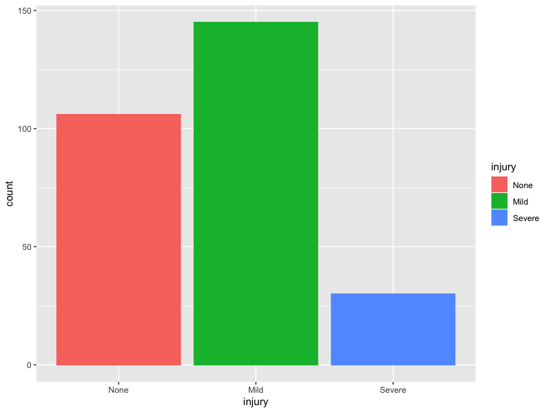

# Chapter 12

## 12.1 Linear classifiers on hepatic data

Well after a lot of faffing didn't really get any great models out of this. Class balance is a bit uneven but not too horrendous, really: 

Used accuracy to tune the models. To look at the final judgements I used negative predictive value for none, i.e. correctly predicts "is damaging" with no regard to magnitude of damage. Table of results is: 

|        LR|       LDA|     PLSDA|      NSC|    GLMPen|what    |
|---------:|---------:|---------:|--------:|---------:|:-------|
| 0.6296296| 0.6034483| 0.6415094| 0.626506| 0.6219512|Bio     |
| 0.7407407| 0.6923077| 0.6896552| 0.626506| 0.6265060|Chem    |
| 0.7000000| 0.6444444| 0.7111111| 0.626506| 0.6265060|BioChem |

So the best overall is the logistic regression (really multinomial) model applied to the chemical data only however all of them are kind of rubbish. 

## 12.2 Linear classifers on phat data

So the first question is whether we need to split data into training and test. The answer is yes - how else do you propose to validate the model? Some cunning is needed to deal with such imbalance. I am going to go for a resampling technique. So I will cut the data into training and test, and then upsample the training data so each class has the same number of observations. 

Using accuracy on this fake data to tune the models should be OK. To evaluate the test set a different statistic will probably be better; let's go with "average accuracy" i.e. for each class in the test data calculate the accuracy of that class and then average the accuracies. So if performance on the rare classes is bad the measure will be poor. 
