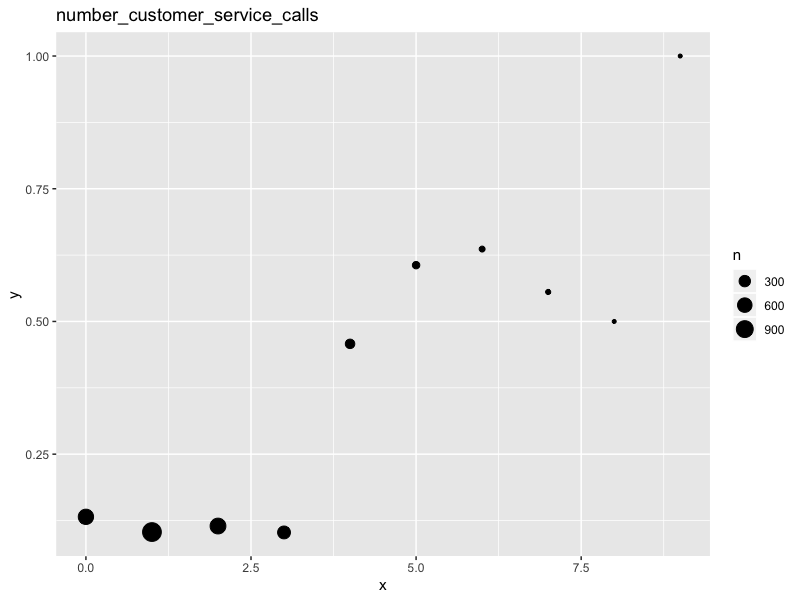
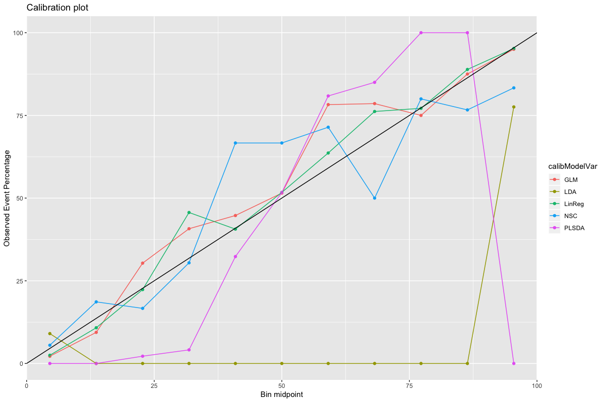

# Chapter 12

## 12.1 Linear classifiers on hepatic data

Well after a lot of faffing didn't really get any great models out of this. Class balance is a bit uneven but not too horrendous, really: 

Used accuracy to tune the models. To look at the final judgements I used negative predictive value for none, i.e. correctly predicts "is damaging" with no regard to magnitude of damage. Table of results is: 

|        LR|       LDA|     PLSDA|      NSC|    GLMPen|what    |
|---------:|---------:|---------:|--------:|---------:|:-------|
| 0.6296296| 0.6034483| 0.6415094| 0.626506| 0.6219512|Bio     |
| 0.7407407| 0.6923077| 0.6896552| 0.626506| 0.6265060|Chem    |
| 0.7000000| 0.6444444| 0.7111111| 0.626506| 0.6265060|BioChem |

So the best overall is the logistic regression (really multinomial) model applied to the chemical data only however all of them are kind of rubbish. 

## 12.2 Linear classifers on phat data

So the first question is whether we need to split data into training and test. The answer is yes - how else do you propose to validate the model? Some cunning is needed to deal with such imbalance. I am going to go for a resampling technique. So I will cut the data into training and test, and then upsample the training data so each class has the same number of observations. 

Using accuracy on this fake data to tune the models should be OK. To evaluate the test set a different statistic will probably be better; let's go with "average accuracy" i.e. for each class in the test data calculate the accuracy of that class and then average the accuracies. So if performance on the rare classes is bad the measure will be poor. 

Plugging in the models, tuning them, and plotting the hit/miss matching of predicted values against truth gives us:

so most of the models are actually OK. PLSDA fails terribly with group G (not surprising - PLS doesn't like single representatives). But nothing to choose between the penalised GLM and the NSC. 

Values of my custom metric are:

|Model  |     Score|
|:------|---------:|
|GLM    | 0.9841270|
|LDA    | 0.9365079|
|LinReg | 0.9206349|
|NSC    | 0.9841270|
|PLSDA  | 0.7936508|

so have to use something else as the tie breaker. Why not `ties.method = 'first'`? GLM it is!

Well, no. We can have a look at the probability calibration plots (so: form ten buckets [0%,10%), [10%, 20%), ..., [90%,100%]; map each training observation into a bucket based on its predicted probability by class; compute obserevd probability versus predicted probability). GLM does poorly here, so go for NSC. 

## 12.3 Telecom data 

This is looking at some churn data from a telecoms firm. Apparently. First thing to do is have a look at the data and see if anything obvious jumps out. Some stuff that seems predictive are the following:

The first two are not even remotely well correlated:

some of the other charge/calls pairs are almost perfecly correlated. Suspect there is something like 'free local calls during daytime' that isn't evident from the data we have. 

Idea: combine the charges to create one master charge thing. This gives us

Very predictive. Also had a look at the states, more because it is pretty than anything else: 

Now onto the model fitting. Used a slightly different way of doing the LDA and linear fits which, instead of putting everything in, do a stepwise regression (i.e. start with nothing, put in stuff which makes the AIC go down the most, repeat). Fairly naïve method of model selection but it will do for here (this stuff isn't going into production anywhere). 

Overall performance statistics:

|name     |   GLM|   LDA| LinReg|   NSC| PLSDA|
|:--------|-----:|-----:|------:|-----:|-----:|
|Accuracy | 0.909| 0.901|  0.912| 0.901| 0.902|
|Kappa    | 0.526| 0.454|  0.551| 0.457| 0.478|

Kappa is 'occurence adjusted accuracy': as c. 15% of the data churns a dumb 'just say no' model gets 85% accuracy. We want to look at how much extra accuracy the model gives us, which is what the kappa statistic does. So here the old fashioned linear models win. 

Some other statistics: 

|name                 |   GLM|   LDA| LinReg|   NSC| PLSDA|
|:--------------------|-----:|-----:|------:|-----:|-----:|
|Balanced Accuracy    | 0.716| 0.677|  0.732| 0.679| 0.693|
|Detection Prevalence | 0.077| 0.064|  0.085| 0.065| 0.073|
|Detection Rate       | 0.061| 0.050|  0.065| 0.050| 0.055|
|F1                   | 0.572| 0.502|  0.597| 0.505| 0.528|
|Neg Pred Value       | 0.920| 0.910|  0.925| 0.910| 0.914|
|Pos Pred Value       | 0.783| 0.776|  0.773| 0.771| 0.752|
|Precision            | 0.783| 0.776|  0.773| 0.771| 0.752|
|Prevalence           | 0.134| 0.134|  0.134| 0.134| 0.134|
|Recall               | 0.451| 0.371|  0.487| 0.375| 0.406|
|Sensitivity          | 0.451| 0.371|  0.487| 0.375| 0.406|
|Specificity          | 0.981| 0.983|  0.978| 0.983| 0.979|

Again Lin Reg and GLM seem to do better by most measures. How to choose between them? Well we can have a look at the lift curve:

And also the probability calibration curve:

LinReg looks better calibrated (don't even need to rebalance); GLM looks a bit worse. Lift curve wise it is hard to choose really. So why not Lin Reg as it is simpler? 

Finally we can have a look at how good my new factors are for the selected model. So looks like my lazy attempt at feature engineering made something quite informative:

