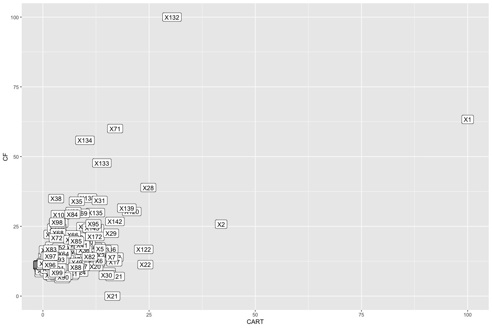

# Chapter 14

## 14.1 Variable importance 

### Common factors

#### Bagging

* Contract Value Band
* A.CI

#### Random Forests 

* Contract Value Band 
* Unsuccess.CI
* Success.CI
* Day
* Month (kinda) 
* Weekday (kinda) 
* Sponsor (kinda) 
* Category Code (kinda) 

#### Boosting

* Contract Value Band 
* Sponsor Code
* Unsuccess.CI
* Success.CI 
* NumCI
* Day
* Weekday (kinda) 

### `PART` prolificism

These were Sponsor Code, Contract Value Band, Unsuccessful CI grants, successful CI grants, and number of chief investigators. Much overlap with boosting, some with random forest, and limited with bagging (only Contract Value). 

## 14.2 Telecom

First Q - do we want split or grouped factors for simple trees? well let us have a look:

So the answer is 'it depends'. Next Q: does boosting or bagging help at all? Again, let's have a look:

Boosting helps quite a bit; bagging not so much. Kappas in the 90s are really good so these are all nice models. 

I fat a bunch of models and got the following stats:

|model           |  Accuracy|     Kappa|
|:---------------|---------:|---------:|
|Boosted.Grouped | 0.9814037| 0.9150992|
|Boosted.Split   | 0.9814037| 0.9150992|
|C50.Split       | 0.9808038| 0.9121846|
|RF.Split        | 0.9796041| 0.9066961|
|Bagged.Grouped  | 0.9790042| 0.9037588|
|Bagged.Split    | 0.9790042| 0.9037588|
|CART.Grouped    | 0.9784043| 0.9012077|
|CART.Split      | 0.9784043| 0.9012077|
|RF.Grouped      | 0.9784043| 0.9008096|
|J48.Grouped     | 0.9772046| 0.8973669|
|C50.Grouped     | 0.9772046| 0.8952990|
|J48.Split       | 0.9760048| 0.8923902|

So they all perform quite similarly. 

Lift plots look a bit strange. Think this is my highly informative predictor getting in the way. First for grouped data:


then for split data


Also we can have a look at one of the decision trees too:


## 14.3 Hepatic Injury 

Fitting the two models shows that the tree based model gives the best answer with `mtry = 75`:

| mtry|  Accuracy|     Kappa| AccuracySD|   KappaSD|what |
|----:|---------:|---------:|----------:|---------:|:----|
|   75| 0.5740269| 0.2245286|  0.0372807| 0.0609511|CART |
|   25| 0.5588245| 0.1723637|  0.0449506| 0.0670967|CF   |

Looking at the times:

```R
> rfCART$time$everything['elapsed']
elapsed 
440.314 
> rfCForest$times$everything['elapsed']
elapsed 
384.778 
```

So the plain trees are better at the expense of extra compute time. I think the gain is worth it as it's not that much more time consuming. 

Variables in the top 20 for both are 
```R
> intersect(t20$CART,t20$CF)
[1] "X1"   "X132" "X28"  "X120" "X139" "X71"  "X142"
```
Not very many! Seems like not enough iterations for convergence or very highly correlated predictors which are being cherry picked at random by the methods. 

