# Chapter 16
## 16.1

Some income data. Lots of it has `NA` for the outcome so strip those out. Not many NAs left so will use KNN etc to fill in gaps (or maybe just have NA as a level?)

First up: how does the data look? so only looking at the training set here. 

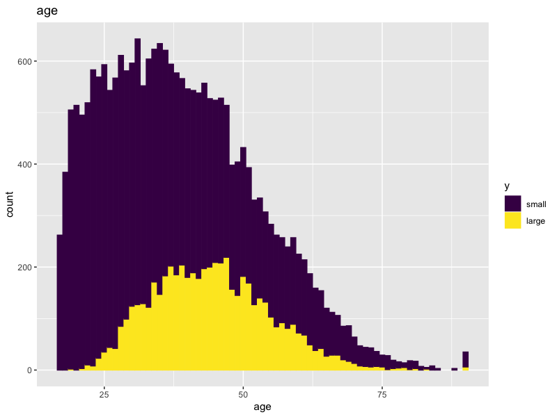 

Non-linear relationship with age here. Old and young less likely to have high income than those in the middle / end of their careers

 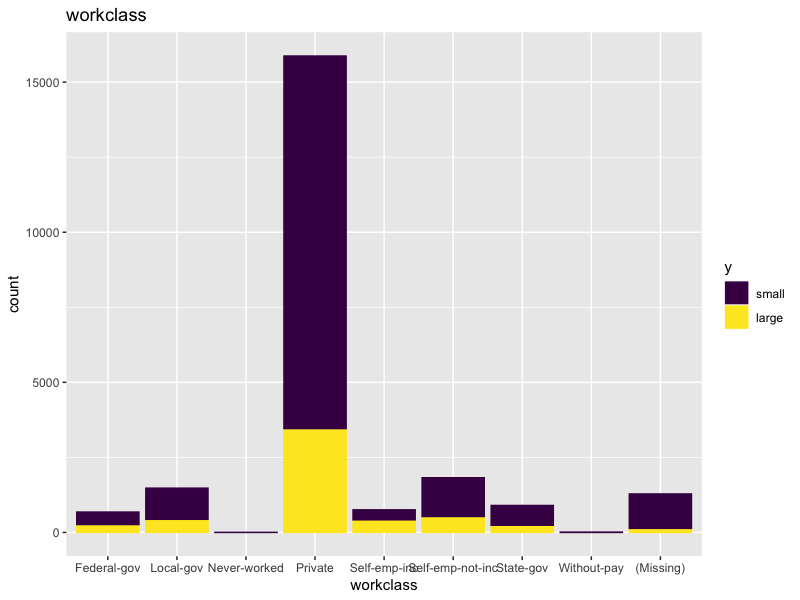 
 
 Some biases here
 
 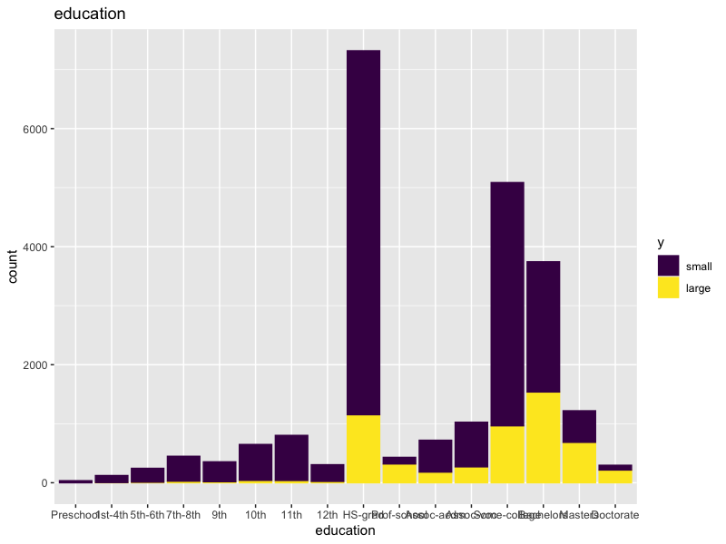 
 
 Higher education level = more income, generally 
 
  
 
 Marriage helps 
 
 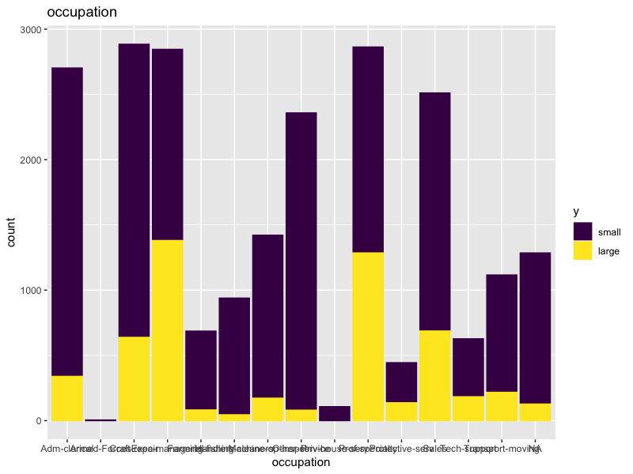 
 
 Some biases in here too
 
 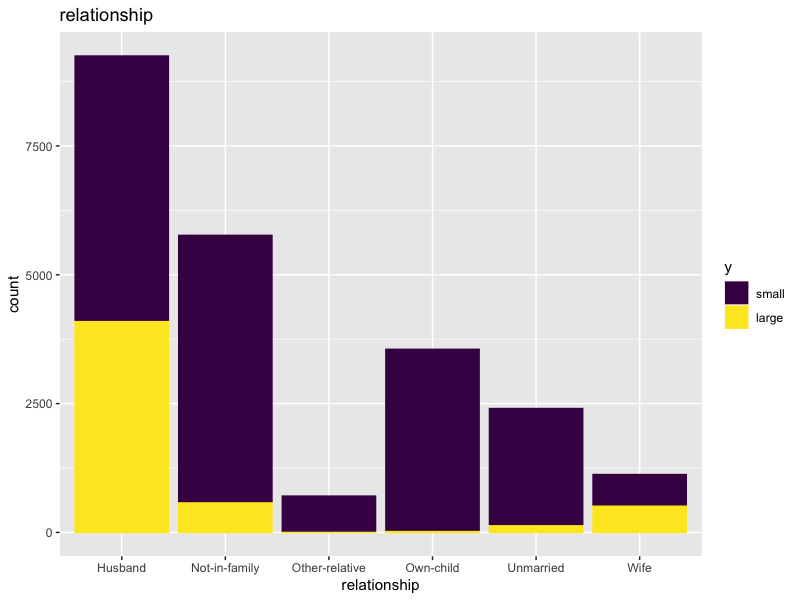 
 
 Gonna be very confounded with relationship 
 
 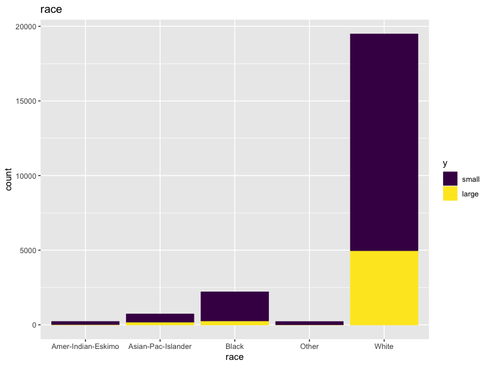 
 
 This is America, so it seems being white helps 
 
 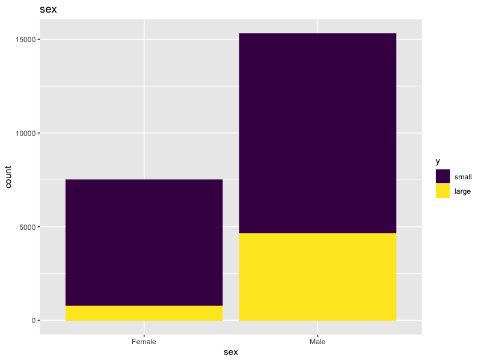 
 
 This is a patriarchy, so being male helps 
 
 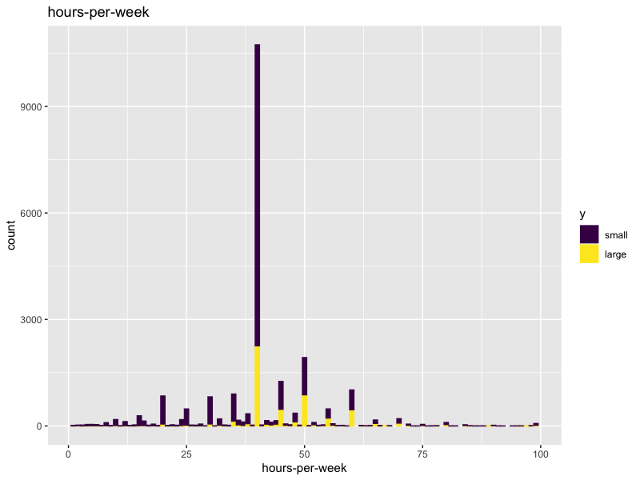 
 
 More hours = more money, but likely to be confounded
 
 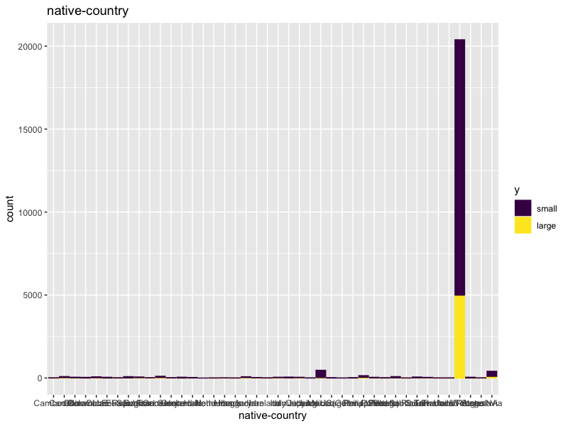 
 
 Americans vs everyone else. Need a finer look 
 
 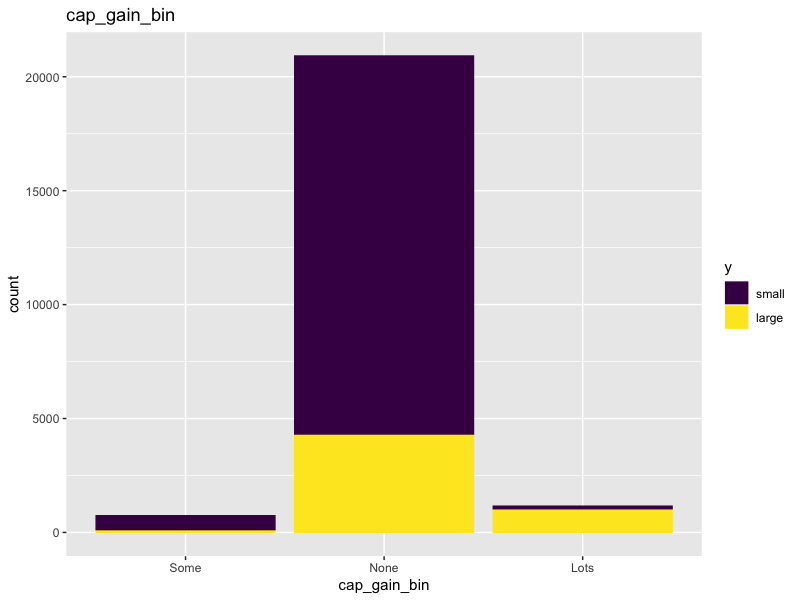 
 
 Perhaps not surprisingly, if you have any capital gains at all you probably have a high income.
 
 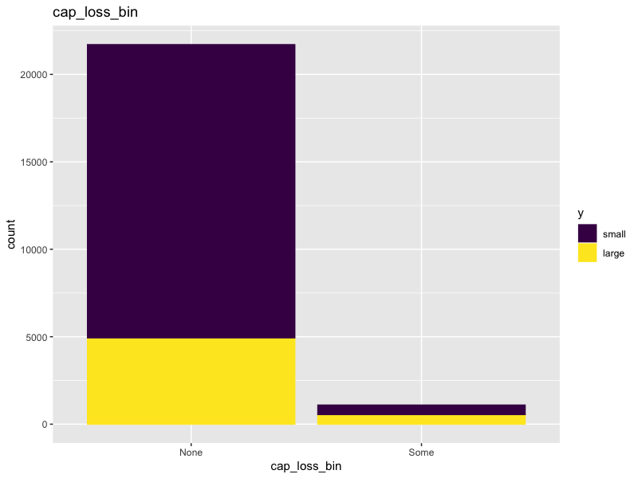 
 
 Capital losses seem to imply some higher income... but not that strong. 
 
 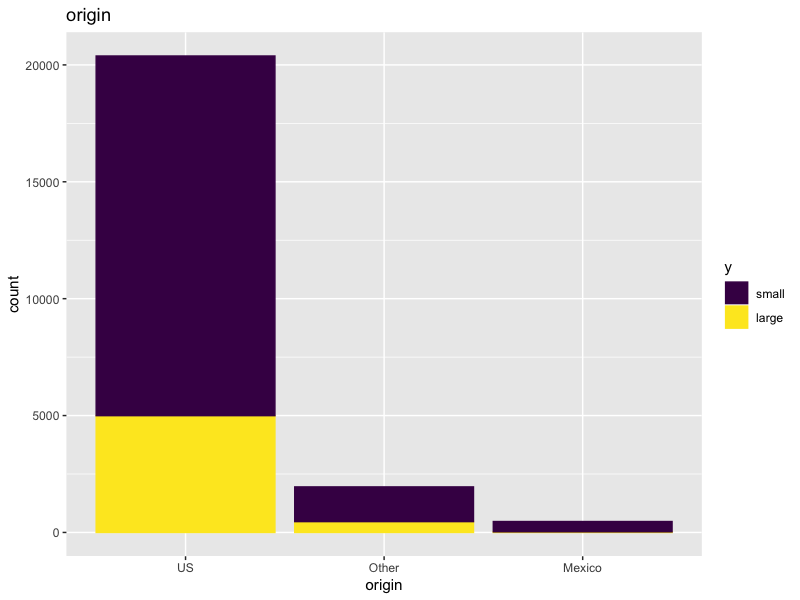 
 
 Binned into US, Mexico (biggest other one) and Everyone Else. 