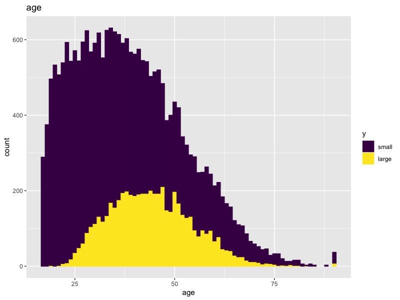
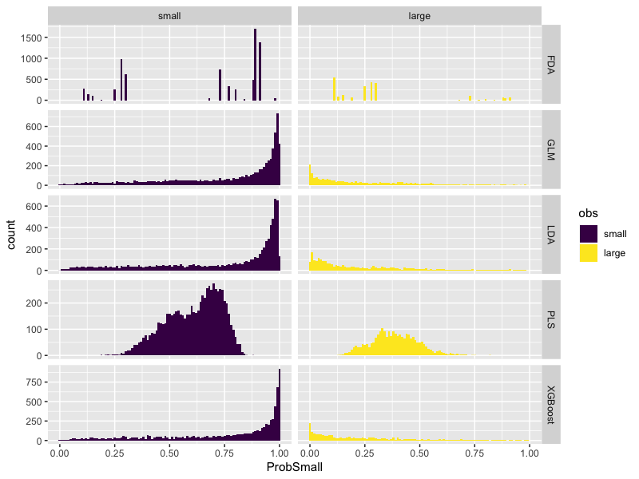
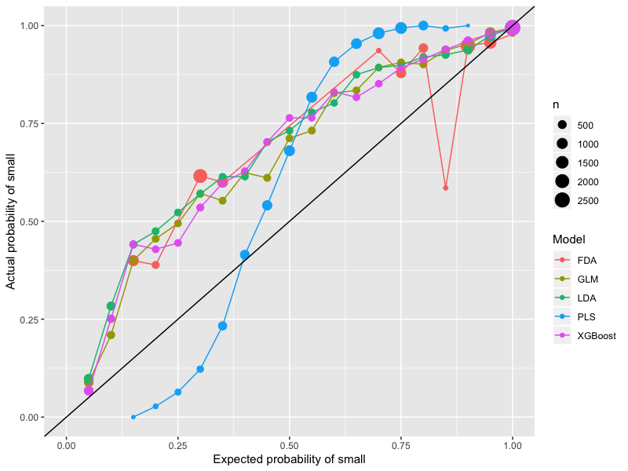
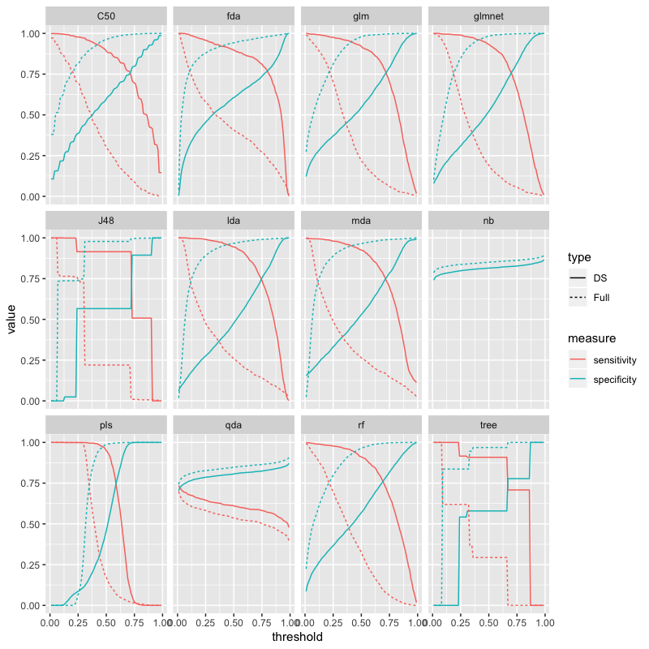

# Chapter 16
## 16.1

Some income data. Lots of it has `NA` for the outcome so strip those out. Not many NAs left so will use KNN etc to fill in gaps (or maybe just have NA as a level?)

First up: how does the data look? so only looking at the training set here. 

 

Non-linear relationship with age here. Old and young less likely to have high income than those in the middle / end of their careers

  
 
 Some biases here
 
  
 
 Higher education level = more income, generally 
 
  
 
 Marriage helps 
 
  
 
 Some biases in here too
 
  
 
 Gonna be very confounded with relationship 
 
  
 
 This is America, so it seems being white helps 
 
  
 
 This is a patriarchy, so being male helps 
 
  
 
 More hours = more money, but likely to be confounded
 
  
 
 Americans vs everyone else. Need a finer look 
 
  
 
 Perhaps not surprisingly, if you have any capital gains at all you probably have a high income.
 
  
 
 Capital losses seem to imply some higher income... but not that strong. 
 
  
 
 Binned into US, Mexico (biggest other one) and Everyone Else. 
 
 ### Model fits
 
 I fitted some models. One of them (PLS) turned out to have terrible calibration so I used the sigmoid filter to reweight the probabilities. 
 
 First up is a table of Kappa statistics on the test set. Clearly XGBoost wins (but takes forever to train). 
 
|Model          |     Kappa|
|:--------------|---------:|
|PLS            | 0.5309859|
|LDA            | 0.5344823|
|GLM            | 0.5372423|
|PLS-Calibrated | 0.5472139|
|FDA            | 0.5488965|
|XGBoost        | 0.5630757|
 
Interestingly the calibration exercise (which takes seconds) gets another 1.7% of Kappa. 

ROC curves also show this - including a zoom on the interesting bit

Histograms of class probabilities by model, and also on a log scale:

These show that the best models really do a good job of picking out samples with small income, but the distribution for large income is very uniform. So are the models being biased by the initial data volume? 

Finally a calibration plot to prove we have well calibrated probabilities.

 
 ### Kappa investigation 
 
 So one thing we could do is strike a balance between sensitivity and specificity. In other words we could goal seek the threshold probability between 'small' and 'large' to get a bigger kappa. Probably means accepting a few more false positives in order to get many more true positives until the ratio peaks. 
 
 Easily done. Well kind of. Turns out we can improve kappa by some few % by choosing the threshold appropriately. As won't be surprising from earlier investigations, sliding the threshold from the default 50% to the right a bit get a better result. There is no a priori reason why 50% is the right number for the default, beyond some vaguely Bayesian reasoning, so we can monkey this as we want. (This is actually quite a significant improvement, c. 5%-10% on a relative basis which is really pretty good). 
 
 XGBoost does very well which it should given how long it takes to train. FDA is a lot quicker and not far off! 
 
|what    | DefaultKappa| BestCutoff| BestKappa|
|:-------|------------:|----------:|---------:|
|XGBoost |    0.5630757|  0.6146755| 0.5946793|
|FDA     |    0.5488965|  0.6743684| 0.5818072|
|PLS     |    0.5309859|  0.5749232| 0.5732821|
|GLM     |    0.5372423|  0.6656615| 0.5669398|
|LDA     |    0.5344823|  0.7325691| 0.5660098|

### Downsampling

OK so the main issue seems to be that large incomes are rare so models are biased. We can work around this by downsampling i.e. chucking away data until large and small are balanced. Doesn't seem to be too effective in this instance but worth a shot nonetheless. 

Tuning for Kappa gets better performance, markedly so in some instances. FDA went weird. 

|what    | DefaultKappa| BestCutoff| BestKappa|
|:-------|------------:|----------:|---------:|
|XGBoost |    0.5544337|  0.3468401| 0.5932938|
|PLS     |    0.5448712|  0.4450144| 0.5778164|
|GLM     |    0.5539478|  0.3650493| 0.5704134|
|LDA     |    0.5368149|  0.3998095| 0.5661040|
|FDA     |    0.4097108|  0.3820119| 0.4097108|

Here are some more plots. Note the calibration issues. 

 
The models which admit costs take too long to run so not tried those. I can imagine e.g. c5.0 doing well if we penalise the 'right' kind of mistake more than the others. 

## 16.2 

So this was interesting. Downloaded data from the link and plugged it in. Constructed some one way plots and correlations. There are some highly informative predictors:

correlation structure shows lots of clustering etc to worry about too:

One thing to do later is try some engineering. I think e.g. 'not 0?' predictors could be more informative than actual numbers. Maybe summing across columns too. 

Did both a proportionate split and a very agressive downsampling of the undesired class (dataset is massive so chucking away lots of uninteresting datapoints is actually OK. I still don't like it). 

Built a load of models. Downsampling does make a difference in some cases: 

In terms of percentage to find 60% of custs, the best is fda trained on the full data set (20.7%). So a little over twice as many contacts as needed (as perfect model needs 10.0%). 

|model   |        DS|      Full|
|:-------|---------:|---------:|
|perfect |        NA| 0.0996780|
|fda     | 0.2176047| 0.2097838|
|C50     | 0.2218985| 0.2102438|
|glm     | 0.2232786| 0.2133108|
|rf      | 0.2249655| 0.2166846|
|glmnet  | 0.2295660| 0.2287993|
|tree    | 0.2536421| 0.2291060|
|mda     | 0.2366202| 0.2375403|
|pls     | 0.2357000| 0.2386137|
|lda     | 0.2410673| 0.2407606|
|qda     | 0.2554823| 0.2518019|
|J48     | 0.2528753| 0.2534887|
|nb      | 0.2528753| 0.2541021|
|random  |        NA| 0.5873332|

One option not explored is monkeying with the 50% cutoff. Might be something in it. Could trade false positives for fewer false negs (and vice versa).

