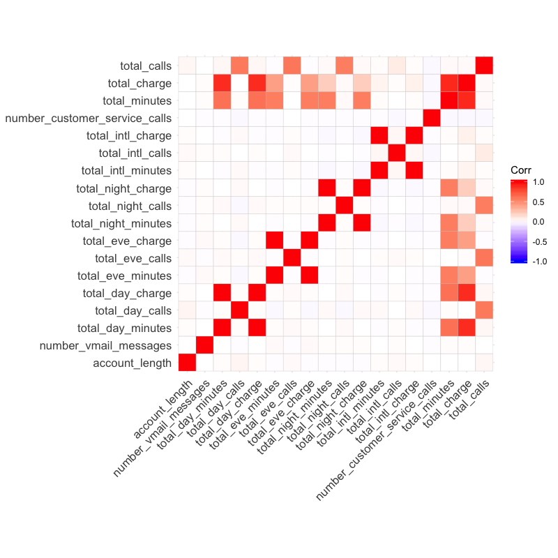
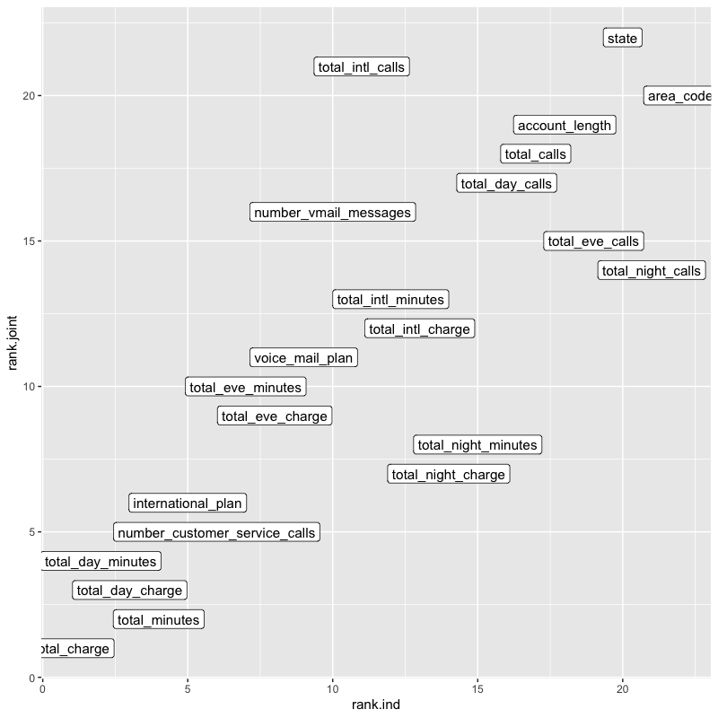
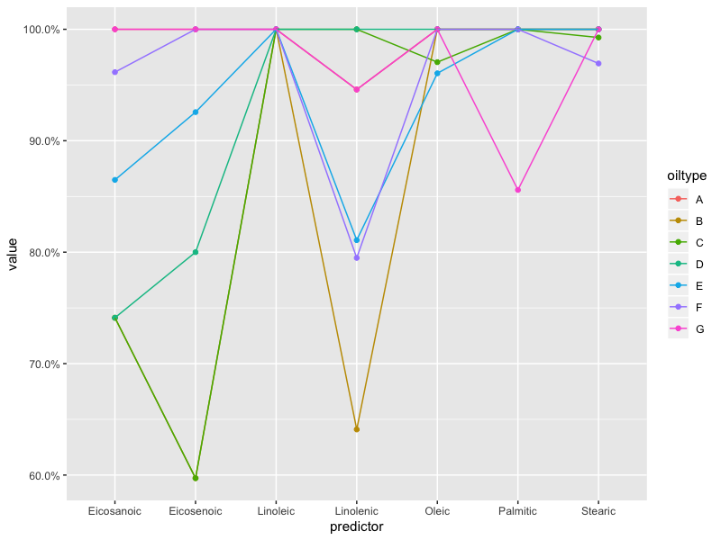
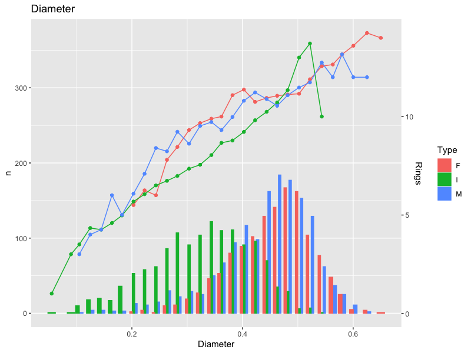
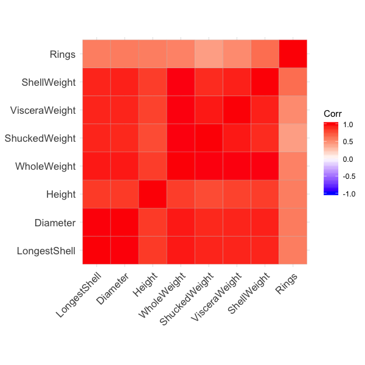

# Chapter 18

## Exercise 18.1

Correlation plot below. As expected lots of very strong relationships between things that measure 'use' e.g. calls, charges, etc. 

Individual importances are:

|rowname                       |key |     value| rank|
|:-----------------------------|:---|---------:|----:|
|total_charge                  |yes | 0.6490411|    1|
|total_day_minutes             |yes | 0.6399666|    2|
|total_day_charge              |yes | 0.6399666|    3|
|total_minutes                 |yes | 0.6381385|    4|
|international_plan            |yes | 0.6091904|    5|
|number_customer_service_calls |yes | 0.6082071|    6|
|total_eve_minutes             |yes | 0.5726508|    7|
|total_eve_charge              |yes | 0.5726417|    8|
|voice_mail_plan               |yes | 0.5649036|    9|
|number_vmail_messages         |yes | 0.5616465|   10|
|total_intl_calls              |yes | 0.5606302|   11|
|total_intl_minutes            |yes | 0.5498979|   12|
|total_intl_charge             |yes | 0.5498979|   13|
|total_night_charge            |yes | 0.5281719|   14|
|total_night_minutes           |yes | 0.5281632|   15|
|total_day_calls               |yes | 0.5215742|   16|
|total_calls                   |yes | 0.5133228|   17|
|account_length                |yes | 0.5127787|   18|
|total_eve_calls               |yes | 0.5070339|   19|
|state                         |yes | 0.5052087|   20|
|total_night_calls             |yes | 0.5038491|   21|
|area_code                     |yes | 0.5024565|   22|

joint ones are

|name                          |     value| rank|
|:-----------------------------|---------:|----:|
|total_charge                  | 0.1966766|    1|
|total_minutes                 | 0.1869194|    2|
|total_day_charge              | 0.1637942|    3|
|total_day_minutes             | 0.1637800|    4|
|number_customer_service_calls | 0.1456000|    5|
|international_plan            | 0.1132000|    6|
|total_night_charge            | 0.1121260|    7|
|total_night_minutes           | 0.1120300|    8|
|total_eve_charge              | 0.1004576|    9|
|total_eve_minutes             | 0.1003939|   10|
|voice_mail_plan               | 0.0594000|   11|
|total_intl_charge             | 0.0520963|   12|
|total_intl_minutes            | 0.0519833|   13|
|total_night_calls             | 0.0491869|   14|
|total_eve_calls               | 0.0401255|   15|
|number_vmail_messages         | 0.0342314|   16|
|total_day_calls               | 0.0330364|   17|
|total_calls                   | 0.0287259|   18|
|account_length                | 0.0250287|   19|
|area_code                     | 0.0196000|   20|
|total_intl_calls              | 0.0187333|   21|
|state                         | 0.0048000|   22|

Can plot together. Very similar but as Relief is a joint measure some correlated things drop in importance.

## 18.2

So with mutliple output classes we get differing importances by class and predictor:

## 18.3

So. Abalone. Or ormer as I call them. 

The dataset looks vaguely the same most of the time - the bigger, the more rings:

Could maybe put quadratics in for some features. But not now. They're all very highly correlated:

Variable importance is interesting. Type (i.e. child or not) matters, all the bigness is very similar. 

|rowname       |    Overall|
|:-------------|----------:|
|Type          | 28.7688124|
|Height        |  1.9227583|
|ShellWeight   |  0.5892443|
|Diameter      |  0.5379761|
|WholeWeight   |  0.5337033|
|LongestShell  |  0.5305664|
|ShuckedWeight |  0.5060171|
|VisceraWeight |  0.1533918|

Looks like basically one thing of bigness and one of type (maybe) will matter. PCA suggests one numeric predictor will be enough for 95% of the variance: 

    Standard deviations (1, .., p=7):
    [1] 0.58152448 0.06296055 0.05392322 0.03247929 0.02212835 0.02065884 0.01217135
    
    Rotation (n x k) = (7 x 7):
                         PC1         PC2         PC3          PC4         PC5           PC6          PC7
    LongestShell  0.19315606  0.35006929 -0.65543596 -0.038784599  0.15584501 -0.0005606153 -0.620285186
    Diameter      0.15955208  0.31882074 -0.50547308  0.018060452  0.07483574  0.0302034552  0.781379947
    Height        0.05928271  0.13475175 -0.08607958  0.004683252 -0.92444847  0.3377048831 -0.047395498
    WholeWeight   0.84261922  0.01882402  0.31147028 -0.127977156  0.16797945  0.3846953125 -0.006247874
    ShuckedWeight 0.37195895 -0.70343169 -0.33727250  0.353767145 -0.16244383 -0.3184028855  0.012572505
    VisceraWeight 0.18225102  0.01294771  0.02506135 -0.762977566 -0.20728245 -0.5828809182  0.033732861
    ShellWeight   0.22834926  0.51216078  0.30999426  0.523911759 -0.13392483 -0.5439869513 -0.033321509

