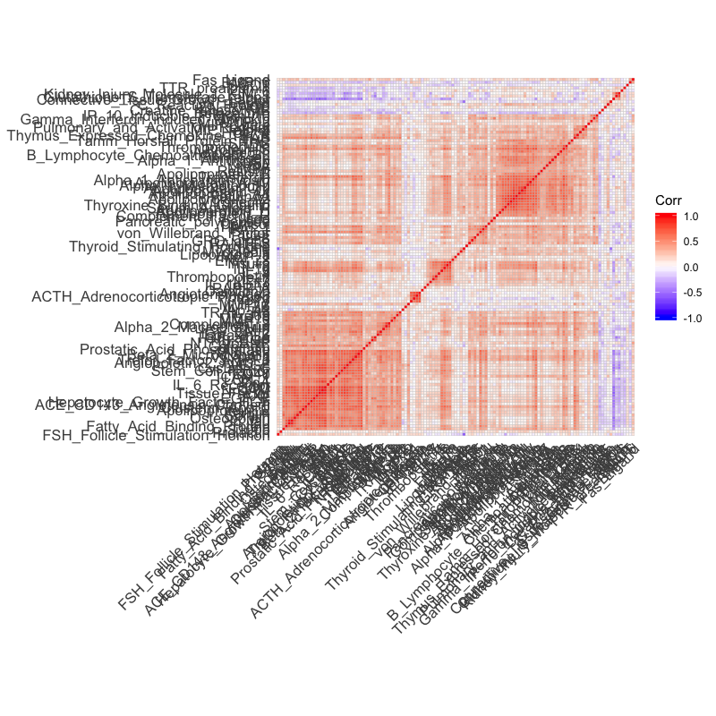
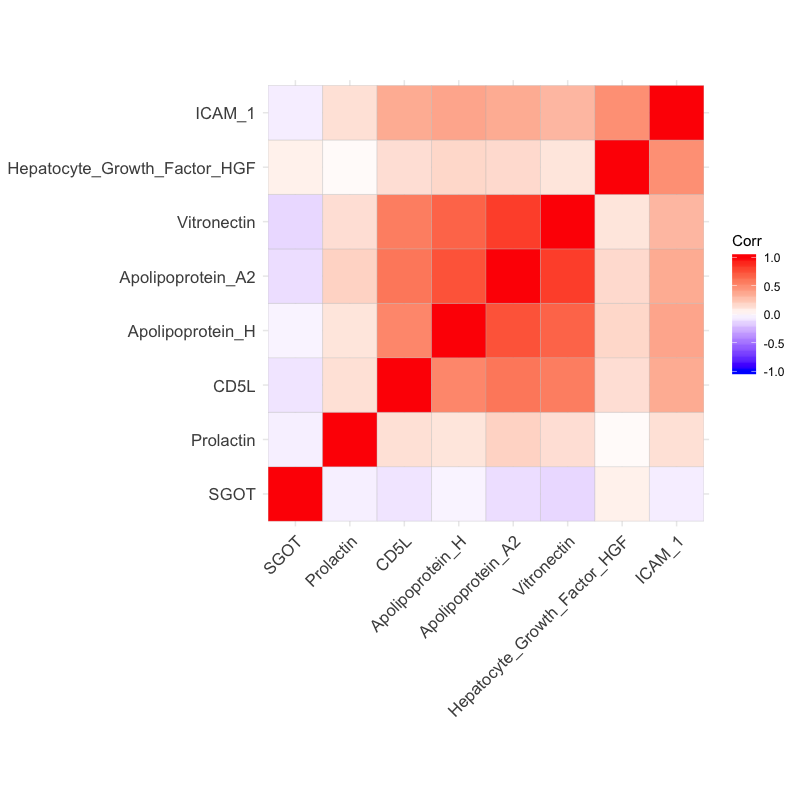
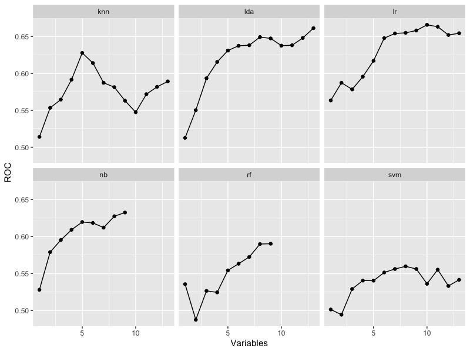

# Chapter 19

## 19.1 

So initially there is loads of predictors:

Chucking away anything with a correlation of >99.9% reduces this massively: 

Redoing all the RFE stuff gets us this: 

So get better performance in many instances by throwing away uselessly redundant predictors. But some models are able to use the slightly different predictors meaningfully.