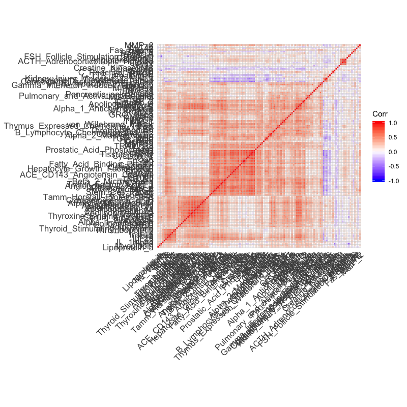

# Chapter 19

## 19.1 

So initially there is loads of predictors:

Chucking away anything with a correlation of >99.9% reduces this massively: 

Redoing all the RFE stuff gets us this: 

So get better performance in many instances by throwing away uselessly redundant predictors. But some models are able to use the slightly different predictors meaningfully.

Note that for some models I flattened the factor into dummy vars and for other models I did not. so not quite apples to apples. deal with it. 

## 19.2

Code took several days so I killed it. I need a better machine. Here is the LDA profile for a range of performance measures.

