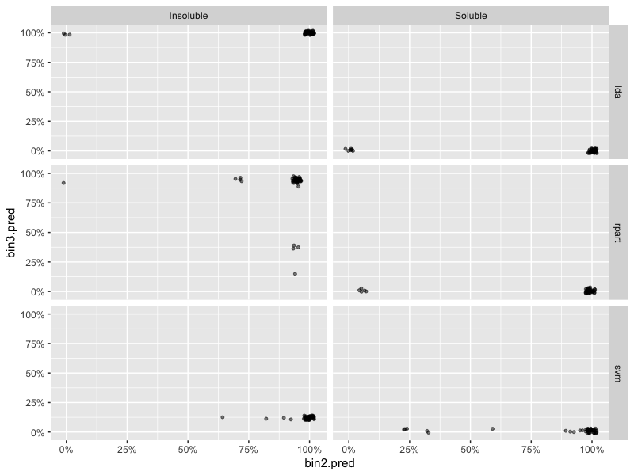
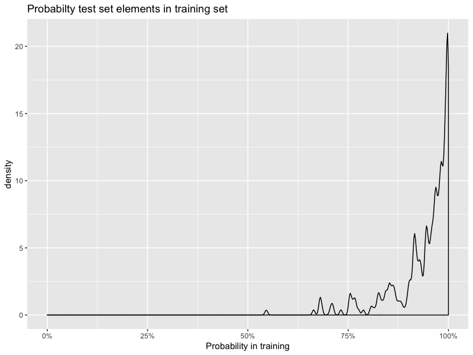

# Chapter 20
Last one! Yay!

## 20.1

a) Hard to say which continuous model performs the best. The tree is clearly the worst but the remainder are all kind of similar. Maybe glm is best. 

b) For the NNet classifier, a predicted prob of zero has a range of -10 to -2 log solubility. This is huge! On the NNet regression model, the range is far narrower at -10 to -8. So here the regression model is better. 

c) None of the binary classifiers beat the regression models. Even the worst regression model (the tree) is is a little better than the best classifier (glm). 

## 20.2

Linear is LDA, nonlinear is SVM, tree is rpart. Fit 3-way classifiers to the data going for most 'mean balanced accuracy' between the classes. Get the following scores on the test set:

|name  |     value|
|:-----|---------:|
|lda   | 0.7763479|
|svm   | 0.7631828|
|rpart | 0.8004279|

so not bad really. Ideally want 95% or more though. Removing the indeterminate group and training a two class model gives the following comparison balanced accuracy statistics (here, mean balanced accuracy = balanced accuracy in the two class condition)

|name  |         2|         3|
|:-----|---------:|---------:|
|lda   | 0.8847518| 0.7763479|
|rpart | 0.9298379| 0.8004279|
|svm   | 0.9404762| 0.7631828|

So it is the fuzzy middle causing problems. Sensitivity and specificity, with insoluble being positive in the two class thing, are:

|id    | Sensitivity| Specificity|
|:-----|-----------:|-----------:|
|lda   |   0.9361702|   0.8333333|
|rpart |   0.9787234|   0.8809524|
|svm   |   1.0000000|   0.8809524|

So they're all very good at picking up insoluble stuff, not quite as impressive as picking up soluble things but they're all OK. In the 3 way situation we have by-class stats:

|id    |class     | Sensitivity| Specificity|
|:-----|:---------|-----------:|-----------:|
|lda   |Insoluble |   0.6808511|   0.9851301|
|lda   |Soluble   |   0.5238095|   0.9452555|
|svm   |Insoluble |   0.5531915|   0.9888476|
|svm   |Soluble   |   0.6190476|   0.9306569|
|rpart |Insoluble |   0.5957447|   0.9776952|
|rpart |Soluble   |   0.7380952|   0.9270073|

so high specificity and not very impressive sensitivities imply that the middle ground has confused the three class models. 

Finally we can have a look at how the class probabilities compare. Haven't calibrated these probabilities so don't want to get mugged by spurious clustering but I do like the spread you get along the x axis with 2 factor SVM. 

## 20.3 

This is an interesting one. So one problem in practice is that your data set can be thinly spread through predictor space, so when you divide into training and test sets your test set involves some extrapolation (i.e., unreliable predictions). So how do you determine whether your test set is within your model's training space? 

This is a cunning algo to do it:

 * tune a model on the training set
 * create fake samples from the training space by sampling from it, smearing predictors everywhere
 * tune another model, this time on actual vs fake training data
 * apply this second model to the original test set and look at the probabilities for being in real data

Doing this with the solubility data gives the following density plot of P(test data is in training set):

So here no test data is >50% to be fake, which is reassuring. Couple of points get close! 