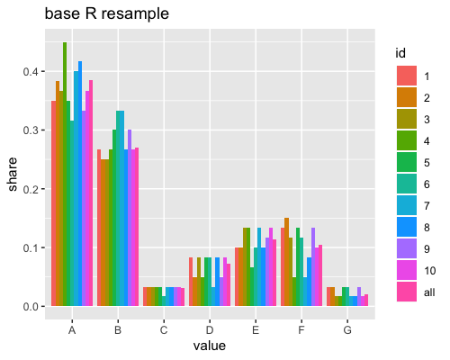
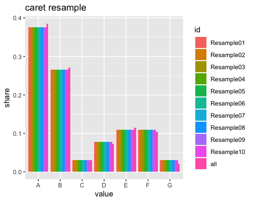
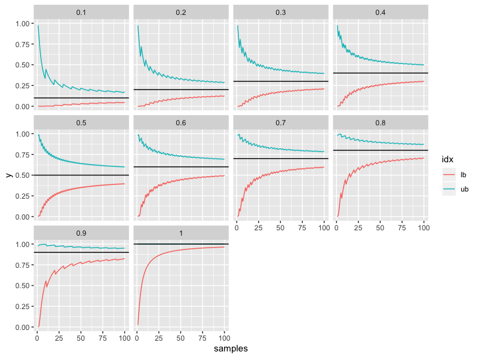

# Chapter 4 exercises

## 4.3 PLS fitting

Can compare `pls.r` output with book to get the following image:

Note with 5 x 10 = 50 resamples, std err is Rsquared / sqrt(50). One standard deviation rule gives choice of three components, agreeing with book answer. 

Given choice of modelled CIs - would go for SVM. Mean from Random Forest is better, but not significantly so, and RF computation time not worth the tiny sliver of supposed performance gains. 

## 4.4 Resampling

The difference between base R and caret resampling techniques is very clear - i.e., `caret::createDataPartition` is much better unless we know why a true random sample is better. 

base R sample: 

Caret sample: 

Data size is very small so we have to be careful in evaluating performance. A single test set would be problematic. This indicates something like repeated cross validation to investigate performance. Perhaps even leave-one-out cross validation if computationally tractable. 

Another investigation is how confidence intervals around the crude sample probability of success varies. For example, we have 100 samples and get a crude estimate of 80% success. This could actually mean a large number of probabilities on a 95% confidence interval basis. Any of the plots below where samples = 100 and y = 0.8 are within the lower and upper bounds could be a candidate for the actual probability! 

Also note log scale on x axis.

