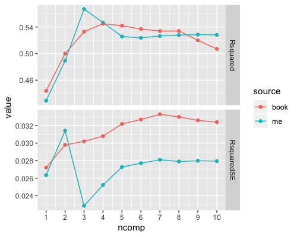

# Chapter 4 exercises

## 4.3 PLS fitting

Can compare `pls.r` output with book to get the following image:

Note with 5 x 10 = 50 resamples, std err is Rsquared / sqrt(50). One standard deviation rule gives choice of three components, agreeing with book answer. 

Given choice of modelled CIs - would go for SVM. Mean from Random Forest is better, but not significantly so, and RF computation time not worth the tiny sliver of supposed performance gains. 
